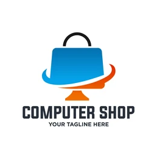

# eShop: Your One-Stop Shop for Electronics

Welcome to eShop, the ultimate online destination for all your electronic needs. From the latest smartphones to cutting-edge laptops, home entertainment systems, and more, eShop offers a wide range of high-quality products at competitive prices.

## Features

- **Wide Range of Products**: Explore our extensive collection of electronics, including smartphones, laptops, tablets, cameras, home appliances, and more.
- **User-Friendly Interface**: Our intuitive and responsive website ensures a seamless shopping experience across all devices.
- **Secure Payments**: We support multiple payment options, including credit/debit cards, PayPal, and more, with end-to-end encryption to keep your transactions safe.
- **Fast Shipping**: Enjoy quick and reliable delivery to your doorstep.
- **Customer Support**: Our dedicated customer support team is available 24/7 to assist you with any queries or issues.

## Getting Started

Follow the steps below to get the eShop up and running on your local machine.

### Prerequisites

- **Node.js**: Ensure that Node.js is installed on your system. You can download it [here](https://nodejs.org/).
- **npm or yarn**: Package manager for managing dependencies.

### Installation

1. **Clone the repository:**
   ```bash
   git clone https://github.com/yourusername/eshop-electronics.git
   cd eshop-electronics
2. **Install dependencies:**
    ```bash
    npm install
3. **Start the development server:**
    ```bash
    npm start
4. **Open browser and visit:**
    http://localhost:3000

## Project Structure
- src/
  - components/  # Reusable UI components
  - pages/       # Different pages of the - application (Home, Product, Cart, etc.)
  - services/    # API calls and business logic
  - assets/      # Images, fonts, and other static assets
- public/      # Publicly accessible files like index.html
- styles/       # Global styles and theme configuration
- package.json  # Project metadata and dependency management
Contributing
We welcome contributions from the community! To contribute:

## Contributing
Contibuted on the project:
- Miroslav Herzan
- Miriam Slaba
- Michaela Holeckova

Contact
If you have any questions or feedback, please feel free to reach out:   

Email: support@eshop-electronics.com
Twitter: @eshop_electronics